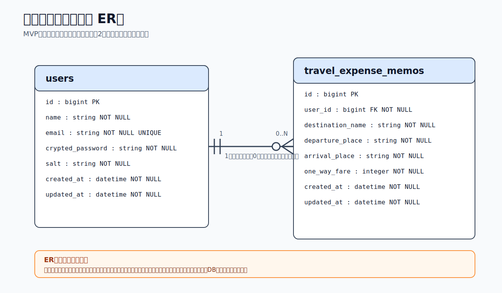
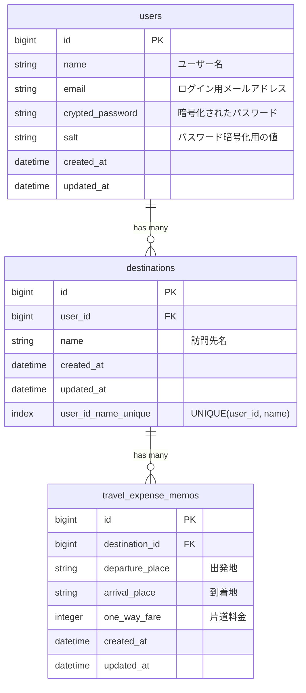

# ER Diagram

## テーブル設計

### users

ユーザー登録・ログインのためのテーブルです。

| カラム名 | 型 | 制約・用途 |
| --- | --- | --- |
| id | bigint | 主キー |
| name | string | ユーザー名、NOT NULL |
| email | string | ログイン用メールアドレス、NOT NULL、ユニーク制約 |
| crypted_password | string | Sorceryで使用する暗号化済みパスワード、NOT NULL |
| salt | string | Sorceryで使用するパスワード暗号化用の値、NOT NULL |
| created_at | datetime | 作成日時、NOT NULL |
| updated_at | datetime | 更新日時、NOT NULL |

### destinations

訪問先を保存するテーブルです。

同じ訪問先に対して複数の出発地・到着地・片道料金を登録できるようにするため、訪問先名は交通費メモから切り出して管理します。MVPでは実装範囲を広げすぎないため、住所や顧客情報などの詳細は持たせず、訪問先名のみを保存します。

| カラム名 | 型 | 制約・用途 |
| --- | --- | --- |
| id | bigint | 主キー |
| user_id | bigint | usersテーブルの外部キー、NOT NULL |
| name | string | 訪問先名、NOT NULL |
| created_at | datetime | 作成日時、NOT NULL |
| updated_at | datetime | 更新日時、NOT NULL |

制約：

- `user_id` と `name` の組み合わせにユニーク制約を設定します。
- 同じユーザーが同じ訪問先名を重複登録できないようにします。
- 別のユーザーであれば、同じ訪問先名を登録できます。

### travel_expense_memos

訪問先に紐づく交通費メモを保存するテーブルです。

| カラム名 | 型 | 制約・用途 |
| --- | --- | --- |
| id | bigint | 主キー |
| destination_id | bigint | destinationsテーブルの外部キー、NOT NULL |
| departure_place | string | 出発地、NOT NULL |
| arrival_place | string | 到着地、NOT NULL |
| one_way_fare | integer | 片道料金、NOT NULL |
| created_at | datetime | 作成日時、NOT NULL |
| updated_at | datetime | 更新日時、NOT NULL |

## リレーション

- users 1 : 0..N destinations
- 1人のユーザーは0件以上の訪問先を登録できます。
- 1つの訪問先は必ず1人のユーザーに紐づきます。
- destinations 1 : 0..N travel_expense_memos
- 1つの訪問先には0件以上の交通費メモを登録できます。
- 1つの交通費メモは必ず1つの訪問先に紐づきます。

## ER図に含めないもの

- 往復料金
  - 片道料金から自動計算して表示するため、DBには保存しません。
- 応援メッセージ画像
  - 登録完了後に固定で表示する画面要素のため、DBには保存しません。
- ログイン・ログアウト
  - ユーザーの操作であり、保存したい情報ではないため、テーブル化しません。
